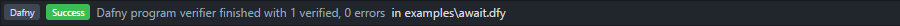
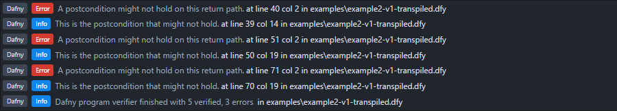

# linter-verification

Linter package with support for the program verification tools [Dafny](https://www.microsoft.com/en-us/research/project/dafny-a-language-and-program-verifier-for-functional-correctness/), Chalice and [Boogie](https://www.microsoft.com/en-us/research/project/boogie-an-intermediate-verification-language/), provided that for each desired tool its grammar (language package) is installed (and, of course, the tool itself).

An example of successful verification:


An example of unsuccessful verification:


## Requirements

1. Install the [Linter](https://atom.io/packages/linter) package.
2. Install the language package for the desired verification language, for example [language-dafny](https://atom.io/packages/language-dafny).

## Installation

Atom → File → Settings → Install → `linter-verification`, or:

```sh
$ apm install linter-verification
```

## Configuration

By default, each supported verification tool is resolved against the `PATH` variable. If the location of the tool's binary is added to the path, there's no need to change its `executablePath` setting.

Additionally, one may change the `executableArguments` (options) passed to the verification tool. By default, the first line (banner) is excluded as this adds needless overhead. For Dafny, compilations are turned off for similar reasons.

It is possible to change these settings in the Settings View:

Atom → File → Settings → Packages → `linter-verification`.

Alternatively, change them via Atom's `config.json`, for example:

```coffeescript
"linter-verification":
  executableSettings:
    # By default the `dafny` binary is resolved from the path variable.
    dafnyExecutablePath: "/path/to/dafny"
    # Execute `dafny /help` for all possible options.
    dafnyExecutableArguments: [
      "/nologo"
      "/compile:0"
    ]
```

## Usage

When you open a file that is associated with the language grammar of the desired verification tool (e.g. `.dfy` for `language-dafny`), the verification tool will be run on the editor's content. Since the verification tools do not accept input from `stdin`, the package writes a copy of the file buffer to the OS's temporary folder each time a change is made to provide continuous verification, without the need to save a file.

Experimental support for the Owicki-Gries method of verification of parallel programs is provided by [`dafny-transpiler`](https://github.com/Alchiadus/dafny-transpiler). When a Dafny file is opened and the first line contains `// Use Owicki-Gries.`, the transpiler will be invoked before the file is passed to Dafny, so that Dafny verifies the transpiled output. Since it can be beneficial to inspect the transpiled output, this file is written to the same directory as the original file.

## FAQ

The FAQ assumes Dafny is the intended verification tool, but typically the questions and answers are also applicable to Chalice and Boogie.

**Q:** _When I open a Dafny file I briefly see 'pending', but after that nothing is shown in the linter panel. No success message and no errors. What gives?_

**A:** This likely means that the Dafny executable is not being called correctly or returns unexpected output.
  - Make sure that Dafny executes properly when you run it directly from the command line. See also: https://github.com/Microsoft/dafny/wiki/INSTALL.
  - Make sure that `dafnyExecutablePath` points directly (and only) to the Dafny executable, so no wrapper script and no options (define those in `dafnyExecutableArguments`).
  - If you are on a Unix system and have to use a wrapper script, make sure the `linter-verification` package can pass the options, as well as the file path to the script. The following example has been confirmed to work on a Mac (note the absence of quotes around `$*`, this is important):

  ```sh
  #!/usr/bin/env bash
  mono /path/to/Dafny.exe $*
  ```
  - If the package detects invalid output from Dafny and cannot show any messages, it prints the stdin and stdout output to Atom's developer console. Access it via: Atom → View → Developer → Toggle Developer Tools and switch to the console tab.

**Q:** _When I open a Dafny file with the experimental Owicki-Gries annotations I do not see linter messages, but when I open a normal Dafny file I do. How come?_

**A:** Make sure the linter error panel's scope is set to project in the settings of the `linter` package. When the transpiler is invoked the linter message points to the transpiled file to provide the ability to click on error messages and jump to the correct line in the transpiled file.

**Q:** _When I open or create a new Dafny file and add `// Use Owicki-Gries.` as first line of the file, the transpiler does not run. Why not?_

**A:** Currently the first line is only checked upon opening a file. Reopen the file and the transpiler should be invoked.
